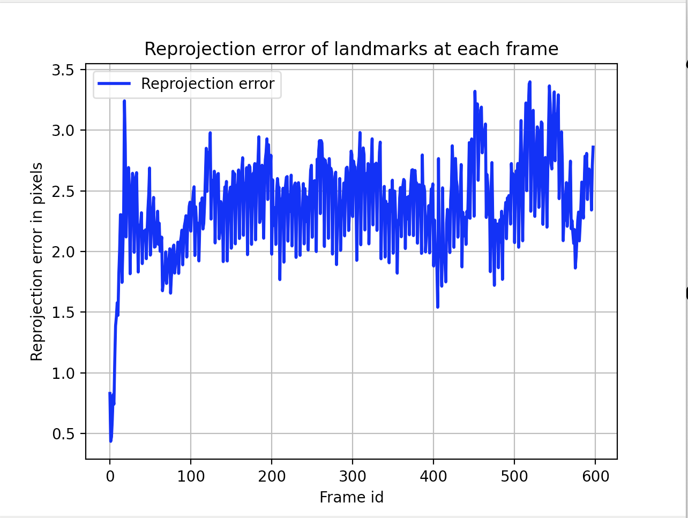
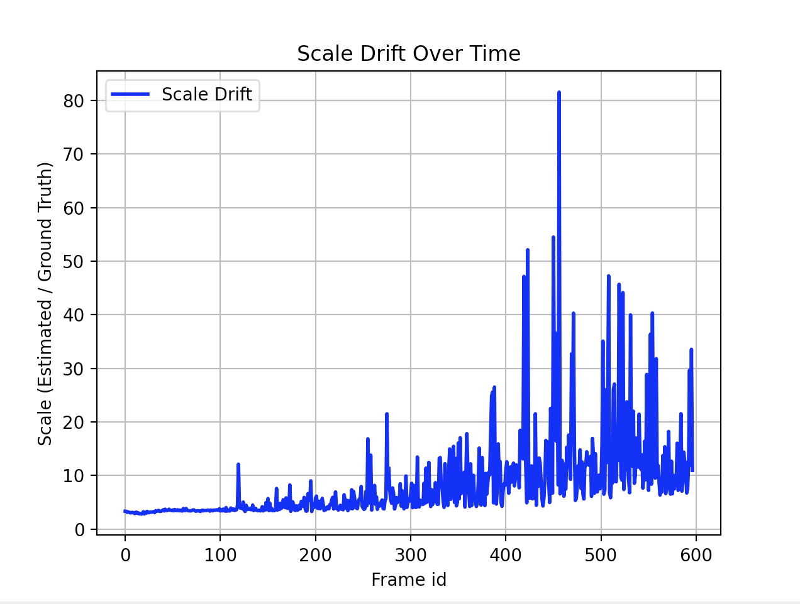

# Visual Odometry Pipeline for the course VAMR at UZH

## Getting started

1. Install the requirements in a Python venv
2. Activate the environment
3. `python src/main.py`
4. Download the parking dataset:
  - `make data/parking`


## Using the CLI

```bash
vo --help
vo run --dataset parking
```

## Conventions

Points are stored as __column vectors__ to facilitate linear algebra matrix multiplications.

__Notation__: 

- `p_W`: points in the World coordinate frame
- `p_I`: points in the Image coordinate frame 
- `p_C`: points in the Camera coordinate frame
- `_hom`: homogenous points
- `T_C_W`: transformation from the World to the Camera coordinate frame. 

__Example__: 

The homogenous 3D points (1, 2, 3, 1) and (4, 5, 6, 1) in the World frame:
```
p_W_hom = np.ndarray(
    [1, 4],
    [2, 5],
    [3, 6],
    [1, 1],
)
```

## Notable progress

1. Adding keypoints using grids. Avoids clustering of keypoints and distributes them over the entire image.
2. Limit number of candidate keypoints. 
    - Eliminates old candidate keypoints (__after__ new ones were added) which may be out of frame and leads to less drift.
    - More efficient computationally
    - Interesting point: returning the new candidate keypoints in random order (shuffling) seems to increase drift.


## Demo (takes a few seconds to load)

- There is __scale drift__ because this is a monocular setup: final camera position is (374.50, -1.51, 43.06) but expected is (89.70, 0, 0)
  - To try: implement bundle adjustment


## Evaluation




