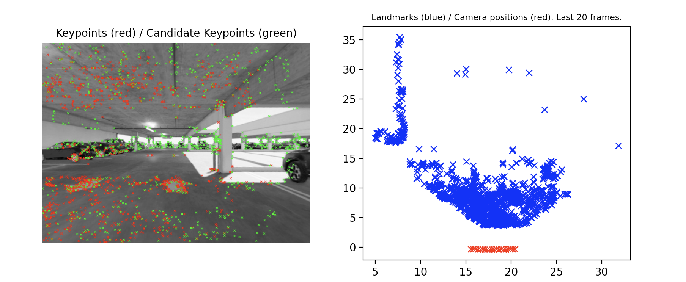
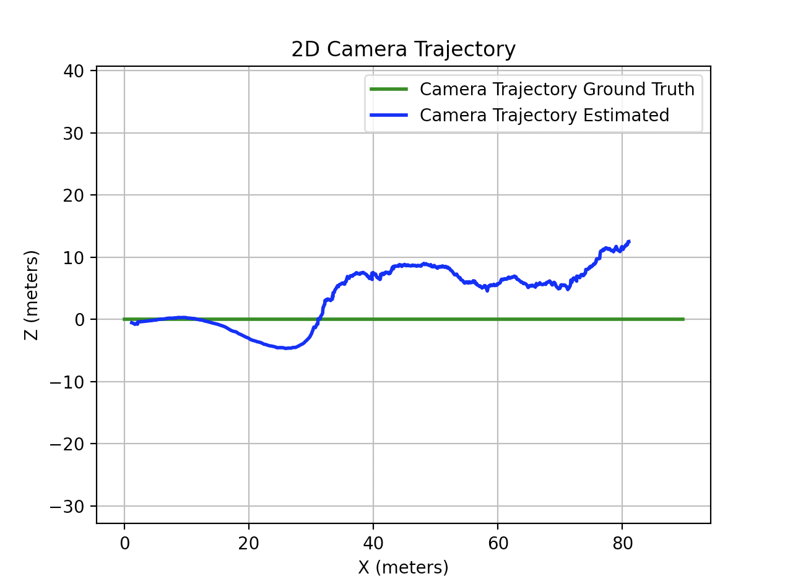
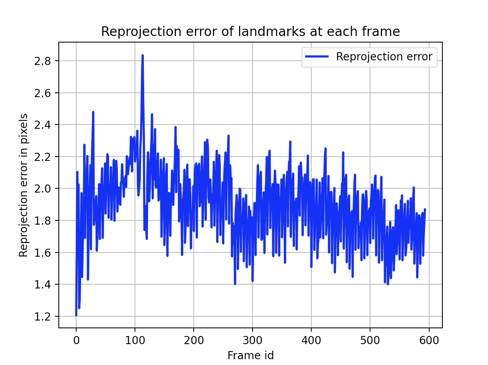
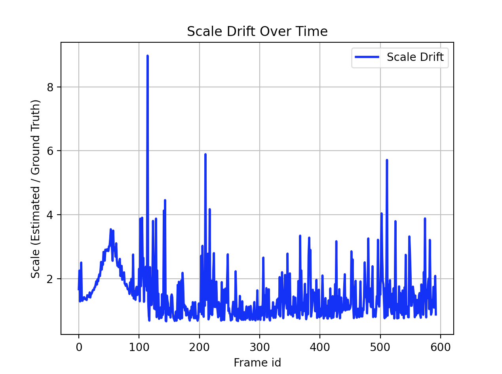

# Visual Odometry Pipeline 

Built a visual odometry pipeline for the course [Vision Algorithms for Mobile Robotics](https://rpg.ifi.uzh.ch/teaching.html#VAMR) at UZH / ETHZ.




## Folder Structure

    .
    │
    ├── assets                  # Results for major improvements
    │
    ├── ba_data                 # Points to use for bundle adjustment (BA)
    │
    ├── cli
    │   └── vo.py               # Main entrypoint of the VO pipeline
    │
    ├── src
    │   ├── features            # Finding features in images (Shi-Tomasi)
    │   ├── io                  # Export points to format used in BA
    │   ├── localization        # Pose estimation and RANSAC
    │   ├── mapping             # Structure from motion and triangulation
    │   ├── structures          # Data containers
    │   ├── tracking            # KLT (Lucas-Kanade Tracker)
    │   ├── transformations     # World-to-camera, camera-to-pixel
    │   └── utils               # Reading images, masks for points, etc.
    │
    ├── tests                   # Lots of unit tests
    │
    └── README.md

## Getting started

1. Install the requirements in a Python venv
2. Activate the environment
3. `python src/main.py`
4. Download the parking dataset:
  - `make data/parking`


## Using the CLI

```bash
vo --help
vo run --dataset parking
```

## Demo 

Might take a few seconds to load.

- There is __scale drift__ because this is a monocular setup. 
- Demo of version `0`


## Conventions

Points are stored as __column vectors__ to facilitate linear algebra matrix multiplications.

__Notation__: 

- `p_W`: points in the World coordinate frame
- `p_I`: points in the Image coordinate frame 
- `p_C`: points in the Camera coordinate frame
- `_hom`: homogenous points
- `T_C_W`: transformation from the World to the Camera coordinate frame. 

__Example__: 

The homogenous 3D points (1, 2, 3, 1) and (4, 5, 6, 1) in the World frame:
```
p_W_hom = np.ndarray(
    [1, 4],
    [2, 5],
    [3, 6],
    [1, 1],
)
```


## Evaluation

- Evaluation of version "3": there is less scale drift. 






## Notable progress

### Version 0

1. Adding keypoints using grids. Avoids clustering of keypoints and distributes them over the entire image.
2. Limit number of candidate keypoints. 
    - Eliminates old candidate keypoints (__after__ new ones were added) which may be out of frame and leads to less drift.
    - More efficient computationally
    - Interesting point: returning the new candidate keypoints in random order (shuffling) seems to increase drift.
    
### Version 1

1. Use images 0 and 4 (rather than 0 and 2) for initialization. This reduced the overall scale drift significantly because the initialization of the 3D point cloud is more accurate. 
2. Use 4 degrees instead of 5 degrees as the min angle to triangulate. 

### Version 2

1. Apply PNP pose refinement on RANSAC inliers

### Version 3

1. Use 6.0 pixels as a filter in PNP RANSAC rather than 8.0 
